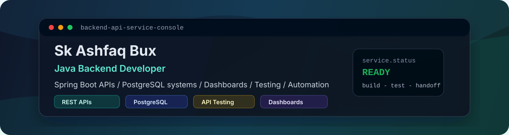

# Sk Ashfaq Bux — Java Backend Developer

Building Spring Boot APIs, PostgreSQL-backed systems, dashboards, automation tools, and practical web solutions.

```yaml
backend_api_service_console:
  build: Spring Boot REST APIs, PostgreSQL modules, dashboard backends
  support: API testing, bug fixes, website/API integration, automation tools
  delivery: clear requirements -> build -> test -> document -> handoff
```

I focus on backend-first systems that are easy to understand, easier to maintain, and useful for real business workflows.

## Service Console

| Service Area | What I Can Help With |
| --- | --- |
| Business Websites | Clean service websites, contact flows, and backend-ready structure |
| Spring Boot REST APIs | CRUD APIs, validation, error handling, layered backend structure |
| PostgreSQL Backend Modules | SQL-backed features, data operations, DBeaver-supported debugging |
| Admin Dashboards / Business Tools | Dashboard backends, internal tools, and workflow screens |
| API Testing & Bug Fixes | Postman collections, manual testing notes, issue reproduction |
| Automation / Integration Support | Small tools, website/API integration, report or workflow automation |

## Tech Stack

| Area | Tools and Technologies |
| --- | --- |
| Backend | Java, Spring Boot, REST APIs, Microservices, Hibernate/JPA, Maven |
| Database | PostgreSQL, SQL, MySQL, DBeaver |
| Testing & Tools | Postman, API Testing, Manual Testing, Git, GitHub, GitLab |
| Frontend Support | React.js, Next.js, HTML, CSS, JavaScript |
| Delivery Focus | Backend support, documentation, testing, practical handoff |

## Current Focus

- Strengthening Spring Boot API proof projects
- Building GitHub-ready backend demos with clear READMEs
- Documenting API testing workflows with Postman and manual test notes
- Improving portfolio proof for freelance clients and recruiters

## Featured Work

| Work | Status | Notes |
| --- | --- | --- |
| [Portfolio Website](https://sk-ashfaq-portfolio.netlify.app/) | Live | Service-focused portfolio for websites, APIs, dashboards, automation, testing, and backend support |
| Spring Boot API Demo | Building Next / Planned | Planned demo for REST APIs, PostgreSQL, validation, error handling, and API documentation |
| API Testing Collection | Building Next / Planned | Planned Postman collection with test notes and sample API testing flow |
| Business Automation Tool | Planned | Planned small tool showing practical automation for a business workflow |

## How I Work

- Small milestones with visible progress
- Clear requirements before building
- Build, test, and document the important parts
- Simple handoff that explains what was built and how to use it

## Next Proof Projects

- Spring Boot business API demo with PostgreSQL
- API testing collection with Postman and manual test cases
- Admin dashboard/API integration demo
- Small business automation tool

## Connect

- Portfolio: [sk-ashfaq-portfolio.netlify.app](https://sk-ashfaq-portfolio.netlify.app/)
- LinkedIn: [Sk Ashfaq Bux](https://www.linkedin.com/in/sk-ashfaq-bux-83057b215/)
- GitHub: [Albidox](https://github.com/Albidox)
